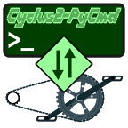

<!--
SPDX-FileCopyrightText: Johannes Keyser <johannes.keyser@uni-hamburg.de>
SPDX-License-Identifier: EUPL-1.2
-->

# Cyclus2-PyCmd

A Python script to interactively send commands to [Cyclus2 ergometers](https://www.cyclus2.com/en/).

> [!warning]
> 🚧 This is prototyping in progress. 🚧

{width=130}

## Description

This project provides a Python script to interactively send commands to a [Cyclus2 ergometer](https://www.cyclus2.com/en/) by RBM elektronik-automation GmbH.

Cyclus2 ergometers include a command interface that can be accessed over a serial interface, Ethernet cable, or WiFi.
Via that interface, you can request data and/or send commands in (near) real time.
This project provides a command-line interface for interactive exploration of Cyclus2 commands.
Eventually, this project can serve as a starting point for more sophisticated scripted interactions with the Cyclus2.

## Usage

Using this script requires some [installation](#installation) and [setup](#setup), see sections below.

Then you can start the command session by running the Python script in a terminal and passing the IP address of your Cyclus2 ergometer.

For example, if your Cyclus2 ergometer has the IP address `192.168.1.200`:

```sh
python Cyclus2-PyCmd.py --address 192.168.1.200
```

During the session, you can use the following commands:

- `HELP` shows the list of available commands.
- `HELP <command>` shows the reference for a specific command.
  For example, `HELP os` shows the reference for command `os`.
- `DISCONNECT` closes the connection to the Cyclus2 ergometer.

The specific command reference is also available from the command line, for example:

```sh
python Cyclus2-PyCmd.py --help-command os
```

> [!TIP]
> You can also browse the command reference in folder [docs/command-reference/](./docs/command-reference/).
> (In fact, the Python code loads the reference from that folder.)

### Example session

```txt
$ python Cyclus2-PyCmd.py
Connected to 192.168.1.200:25000, assuming it is a Cyclus2 ergometer.
Type any Cyclus2 command or use HELP [command] for command help.
Type DISCONNECT to disconnect from the Cyclus2 and end the session.
For example, try vers? and press <Return> for the software version.

> vers?
vers:Cyclus2, Version 5.0.9083.30724

> data?
data:0,0,0.00,0.00,0.00,0.00,0.00,0.00,8.61,0.00,0.00,0.00,0.00

> something-wrong
error:unknown command

> DISCONNECT
Closing the connection to the Cyclus2 ergometer.
```

> [!NOTE]
> The Cyclus2 will send "`error:unknown command`" if the command you entered is unknown/invalid.

## Installation

0. You need [Python](http://python.org) on your computer:
   To install Python, use a method appropriate to your computer and, if applicable, your institutional tools/policies.
1. Clone or download this project to your computer, e.g.:

   ```sh
   git clone https://gitlab.rrz.uni-hamburg.de/dhprl/software/Cyclus2-PyCmd.git
   ```

On your Cyclus2, all required software should be installed, but it requires some [setup, see next section](#setup).

## Setup

To use this script, you only need a working network connection to your Cyclus2 ergometer.
Perhaps as the simplest example, you can connect via a direct Ethernet cable between your computer and the Cyclus2.

- Make sure your computer and the Cyclys2 share the same network.
  For example, you can assign the Cyclus2 a fixed IP address like `192.168.1.200` and your computer an address like `192.168.1.100`.
  Alternatively, use a DHCP server to assign addresses automatically.
- Make sure you can ping the ergometer from your computer, e.g., `ping 192.168.1.200`.
  You should see something like `Reply from 192.168.1.200`.

> [!TIP]
> With this setup, all commands should work, except [changing the baud rate](Further-Info.md#login-as-admin-to-change-serial-baud-rate)

## Support

This project is provided in the hope to be useful, without warranties of any kind (see also section [License](#license)).
No support is included, but feel free to reach out to the [authors](#authors) to ask for help.

This script gets tested on Ubuntu 24.04 LTS with Python 3.12 and on Windows 11 with Python version 3.14.
TODO: Test on MacOS?

## Roadmap

- Handling of commands like `data=7` that keep sending data for a long time.
- Test on Windows (and perhaps MacOS) to ensure cross-platform compatibility.
- Add more explanation what's going on inside the code and during the session (e.g., on what level are errors happening?).
- Try to package this project into a single executable file for even easier usage.
  Perhaps possible with <https://pyinstaller.org>?

## Contributing

Any contribution will be very welcome.
At this stage, please write an email to the authors to report issues, discuss feature requests, or offer patches.
As user of [UHH GitLab](https://gitlab.rrz.uni-hamburg.de), you can also use the GitLab functions.

## Authors

- Johannes Keyser <johannes.keyser@uni-hamburg.de>

## License

This project aims to be [REUSE compliant](https://reuse.software/), indicating for each file the license and copyright information.

All software code is licensed under the European Union Public License (EUPL-1.2) to allow free use and modification, while ensuring that any modifications are also shared under the same license.
See English license text in [LICENSES/EUPL-1.2.txt](./LICENSES/EUPL-1.2.txt); for other languages, see <https://interoperable-europe.ec.europa.eu/collection/eupl/eupl-text-eupl-12>.

Other materials (so far) are licensed under CC0 1.0 Universal Public Domain Dedication for maximal reusability.
See English license text in [LICENSES/CC0-1.0.txt](./LICENSES/CC0-1.0.txt); for a summary and other languages, see <https://creativecommons.org/publicdomain/zero/1.0/deed>.

The [Cyclus2 protocol specification](./docs/command-reference/Cyclus2-protocol-specs.pdf) is published here to allow software development in the context of research and education, but no formal license terms have been decided yet; see [more explanation here](./docs/command-reference/Cyclus2-protocol-specs.pdf.license).

## Project status

Experimental:
This project is currently being prototyped as a lightweight experimental tool for interactive protocol exploration, not as a general-purpose end-user product.
For now, expect breaking changes in each revision.
