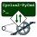
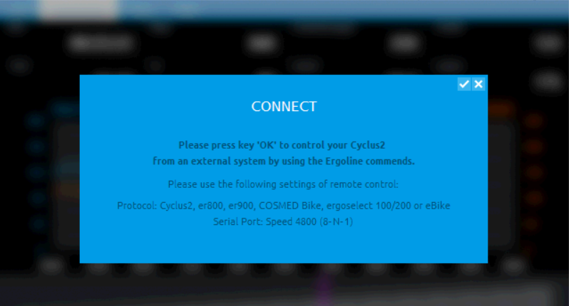
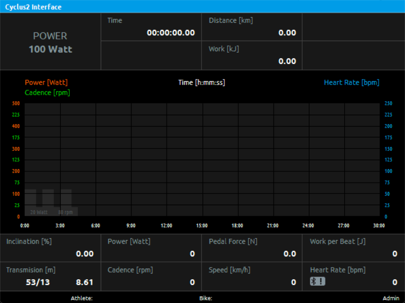

<!--
SPDX-FileCopyrightText: Johannes Keyser <johannes.keyser@uni-hamburg.de>
SPDX-License-Identifier: EUPL-1.2
-->

# Cyclus2-PyCmd

A command-line interface to interactively send commands to [Cyclus2 ergometers](https://www.cyclus2.com/en/).

> [!warning]
> 🚧 This is prototyping in progress. 🚧

{width=120}

## Description

The idea of this project is to create a command-line interface to interactively send commands to a [Cyclus2 ergometer](https://www.cyclus2.com/en/) by RBM elektronik-automation GmbH.

Cyclus2 ergometers offer a command interface that can be accessed over a serial interface or Ethernet, or WiFi.
Via that interface, you can request data and/or send commands in (near) real-time.
This project creates a simple Python-based command-line interface for interactive exploration.
Eventually, this can serve as a starting point for more sophisticated programming-based interaction with the Cyclus2.

## Usage

Using this script requires some [Installation](#installation) and [Setup](#setup), see sections below.

Then you can run the code:

```sh
python Cyclus2-PyCmd.py
```

### Example session

TODO: Showcase a brief session of some simple commands with our own ergometer.

## Installation

0. You need [Python](http://python.org) on your computer:
   To install Python, use a method appropriate to your computer and, if applicable, your institutional tools/policies.
1. Clone or download this project to your computer, e.g.:

   ```sh
   git clone https://gitlab.rrz.uni-hamburg.de/dhprl/software/Cyclus2-PyCmd.git
   ```

On your Cyclus2, all required software should be installed, but it requires some [setup, see next section](#setup).

## Setup

To use this script, you need a working network connection to your Cyclus2 ergometer and enable a command connection on the Cyclus2.

### Network connection

You need to set up a network connection to your Cyclus2 ergometer, e.g. via a direct Ethernet cable.

- Make sure your computer and the Cyclys2 share the same network.
  For example, you can assign the Cyclus2 a fixed IP address like `192.168.1.200` and your computer an address like `192.168.1.100`.
  Alternatively, use a DHCP server to assign addresses automatically.

- Make sure you can ping the ergometer from your computer, e.g., `ping 192.168.1.200`.
  You should see something like `Reply from 192.168.1.200`.

### Enable command connection on the Cyclus2

1. On the Cyclus2, login as _Admin_ by selecting _System → Login_ and entering the administrator password.
   In the bottom right corner, you should see "Admin" now.
2. On the Cyclus2, enable connections by selecting _System → Connect_.
   You should see a dialog like this:

   {width=400}

   Once you press the OK button on the Cyclus2 (or click checkmark if you're using VNC), the Cyclus2 will be ready to accept connections.
   The menu bar at the top of the Cyclus2 screen should now only show "Cyclus2 Interface" instead of the menu items:

   {width=400}

## Support

This project is provided in the hope to be useful, without warranties of any kind (see also section [License](#license)).
No support is included, but feel free to reach out to the [authors](#authors) to ask for help.

At this point, this script was only tested on Ubuntu 24.04 LTS with Python 3.12.

## Roadmap

- Document how to setup and use it, along with some simple examples.
- Test on Windows and perhaps MacOS.
- Add more explanation what's going on inside the code and during the session (e.g., on what level are errors happening?).
- Discuss with RBM about command documentation inside this project and/or where to get more information.

## Contributing

Any contribution will be very welcome.
At this stage, please write an email to the authors to report issues, discuss feature requests, or offer patches.
As user of [UHH GitLab](https://gitlab.rrz.uni-hamburg.de), you can also use the GitLab functions.

## Authors

- Johannes Keyser <johannes.keyser@uni-hamburg.de>

## License

This project is licensed under the European Union Public License (EUPL-1.2).
See full English license text in [LICENSE.txt](./LICENSE.txt); for other languages, see <https://interoperable-europe.ec.europa.eu/collection/eupl/eupl-text-eupl-12>.

## Project status

Experimental:
This project is currently being prototyped.
Expect breaking changes at any moment.
