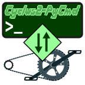

<!--
SPDX-FileCopyrightText: Johannes Keyser <johannes.keyser@uni-hamburg.de>
SPDX-License-Identifier: EUPL-1.2
-->

# Cyclus2-PyCmd 🧑‍💻 ⇄ 🚲

Interactively send commands to [Cyclus2 ergometers](https://www.cyclus2.com/en/).



## Description

This project provides _Cyclus2-PyCmd_, a Python app to interact with [Cyclus2 ergometers](https://www.cyclus2.com/en/) by RBM elektronik-automation GmbH.
Cyclus2 ergometers offer a command interface that you can access over a network (Ethernet or Wi-Fi) or through a direct serial cable.
This allows you to connect a computer to obtain data and control the ergometer in real time.

_Cyclus2-PyCmd_ aims to create a convenient way to interact with a Cyclus2 ergometer:

- It is pre-configured to show the typed commands and their corresponding replies, in a chat-like interface.
  Connect over the network using the ergometer's IP address, or directly with a serial cable.
- You have the command reference at your fingertips via `HELP <command>`.

> [!TIP]
> You can use this project for exploration and as basis for development of scripted interactions with the Cyclus2.
> Browse the [examples](./docs/Examples.md) for inspiration.

## Usage

Using _Cyclus2-PyCmd_ requires [installation](#installation) and a [connection setup](#connection-setup), see sections below.
For a network connection to a Cyclus2 at `192.168.1.200`, start the program as follows:

- Installation from source: `python Cyclus2-PyCmd.py --address 192.168.1.200`
- Installation from a downloaded executable:
  - On Linux: `./Cyclus2-PyCmd --address 192.168.1.200`
  - On Windows: `Cyclus2-PyCmd.exe --address 192.168.1.200`
    (On Windows, you can also double-click the executable to start it; the program will then ask whether to connect via network or serial cable, and for the IP address or serial device, offering a default for each.)

For a direct serial connection, specify the serial device. For example, on Linux a USB-to-serial adapter may appear as `/dev/ttyUSB0`:

```sh
python Cyclus2-PyCmd.py --transport serial --device /dev/ttyUSB0
```

On Windows, the device is a COM port, e.g. `Cyclus2-PyCmd.exe --transport serial --device COM3`.

The serial baud rate defaults to `4800` (8 data bits, no parity, one stop bit, no flow control). If your ergometer is configured differently, set it explicitly, e.g. `--baudrate 9600`.

After connecting, you can type any Cyclus2 command into the prompt and see the response.
To copy text from the chat history, click and drag to select it, then press `Ctrl+C`.
To end the session, use the `QUIT` command.
In addition, you can use the following PyCmd helper commands:

- `HELP` shows the list of available commands.
- `HELP <command>` shows the reference for a specific command.
  For example, `HELP os` shows the reference for [command `os`](/docs/command-reference/commands/os.md).
- `QUIT` closes the connection to the Cyclus2 ergometer.

The command reference is also available without starting a session, for example:

```sh
Cyclus2-PyCmd.exe --help-command os
```

> [!TIP]
> You can also browse the [command reference](./docs/command-reference/README.md).
> (The `HELP` tool in _Cyclus2-PyCmd_ loads that reference and prints the content.)

### Example session

```txt
Welcome to
   _____         __         ___     ___       _____         __
  / ___/_ ______/ /_ _____ |_  |___/ _ \__ __/ ___/_ _  ___/ /
 / /__/ // / __/ / // (_-</ __/___/ ___/ // / /__/  ' \/ _  /
 \___/\_, /\__/_/\_,_/___/____/  /_/   \_, /\___/_/_/_/\_,_/
     /___/                            /___/    version 1.4.0

Type any Cyclus2 command or use HELP [command] for reference.
Press Tab to 'cycle through' or complete half-typed commands.
You can use the mouse to select text and copy it with Ctrl+C.
To end the session, type QUIT to disconnect from the Cyclus2.

Command> vers?
Cyclus2> vers:Cyclus2, Version 5.0.9083.30724

Command> data?
Cyclus2> data:0,0,0.00,0.00,0.00,0.00,0.00,0.00,8.61,0.00,0.00,0.00,0.00

Command> something-wrong
Cyclus2> error:unknown command

Command> QUIT
Disconnected from the Cyclus2 and quit the session. Bye.
```

> [!NOTE]
> The Cyclus2 will reply with "`error:unknown command`" if the command you entered is unknown/invalid.
> This is also sent if the command is not available in the Cyclus2 software version you are using, e.g., if the command was removed in a later version.

> [!TIP]
> See RBM's more interesting [examples](./docs/Examples.md) of the capabilities of the Cyclus2 protocol interface.

## Installation

There are two practical ways to get _Cyclus2-PyCmd_ onto your computer:
Download as an executable app, or install the Python script from source.

On your Cyclus2, all required software should be installed, but some minor [connection setup](#connection-setup) is required.

### Installation without Python

To download an executable, go to the [GitHub Releases page](https://github.com/dhprlab/Cyclus2-PyCmd/releases).
Download the file for your platform (e.g., `Cyclus2-PyCmd-v0.1.5-windows.zip`) and extract it.
Now it is ready for use; no Python installation is required on your computer.

> [!NOTE]
> On Windows, running the executable may show a security warning.
> For example, Windows Defender SmartScreen may warn that the executable is from an unknown publisher.
> If want to trust the executable, you can click "More info" and then "Run anyway"; read about the packging process in [docs/README.md](./docs/README.md#packaging-as-executables).
> If you prefer not to trust the executable, you can use the [installation with Python](#installation-with-python).

### Installation with Python

To directly use the Python script, you need to install [Python](http://python.org), using a method that matches your operating system (and perhaps institutional policies).

Then download this project to your computer, e.g. as file `Source code (zip)` from the [GitHub releases page](https://github.com/dhprlab/Cyclus2-PyCmd/releases), or by using Git to clone it:

```sh
git clone https://github.com/dhprlab/Cyclus2-PyCmd.git
```

Once you have downloaded the project, install the required Python packages and run the script:

```sh
cd Cyclus2-PyCmd
python -m pip install -r requirements.txt
python Cyclus2-PyCmd.py --address IP-ADDRESS-OF-CYCLUS2
```

## Connection setup

Choose either a network connection (Ethernet or Wi-Fi) or a direct serial cable connection to the Cyclus2 ergometer.

### Network connection

The network connection uses TCP/IP and is made using the ergometer's IP address; it does not require an internet connection.

> [!TIP]
> Perhaps as the simplest setup, you can connect your computer directly to the Cyclus2 with any Ethernet cable:
> Modern computers don't need a cross-over cable for a direct connection.

- Make sure your computer and the Cyclys2 share the same network.
  For example, you can assign the Cyclus2 a fixed IP address like `192.168.1.200` and your computer an address like `192.168.1.100`.
  Alternatively, use a DHCP server to assign addresses automatically.
- Make sure you can ping the ergometer from your computer, e.g., `ping 192.168.1.200`.
  You should see something like `Reply from 192.168.1.200`.

### Serial connection

To use the serial interface, you have to connect your computer to the male 9-pin D-sub (DB9) connector on the Cyclus2.
Use the null-modem cable (female DB9 on both ends with crossed wires) that was delivered with your Cyclus2.
At your computer, you either need a compatible male 9-pin D-sub (DB9) connector or an adapter to USB.
Most modern laptops don't have a DB9 connector, so you will likely need a USB-to-serial adapter.

- On Windows, open the Device Manager and look under "Ports (COM & LPT)" for the COM port number (e.g., `COM3`).
  If you are using an adapter and no port appears, install its driver.
- On Linux, check which device was assigned (e.g., `/dev/ttyUSB0` for an adapter or `/dev/ttyS0` for a built-in port).
  If opening the device is denied on Linux, check which group owns it (e.g., `ls -l /dev/ttyUSB*`).
  On Debian and Ubuntu this is `dialout`: Add your user to the group with `sudo usermod -aG dialout $USER`, then log out and in again.
  Other distributions have their own convention, so use the group shown by `ls -l`.
- To use the serial interface, pass the device with `--device`, e.g., `--device COM3` on Windows or `--device /dev/ttyUSB0` on Linux.
- The serial interface defaults to `4800` baud, 8 data bits, no parity, one stop bit, and no flow control.
  Use `--baudrate` if the ergometer has been configured to another baud rate.

> [!NOTE]
> Most commands work regardless of the connection type.
> Continuous data output uses `data=10` over serial and `data=6` over the network; see the [examples](./docs/Examples.md).
> You only need to login as Admin for [changing the baud rate](docs/README.md#login-as-admin-to-change-serial-baud-rate).

## Project status and support

The paint is still fresh 🖌️, but the main functions should be usable.
This project's goal is to provide a reference of possibilities and _PyCmd_ as a tool for quick prototyping and as a stepping stone toward more complex/specific software.
Development of more specialized research software is planned in other, dedicated projects.
(And if _you_ use it to build something public, please let us know, so we can link it in [related projects](#related-projects)!)
<!-- TODO: Would it make sense to make this project citable somehow? -->

This project is made public in the hope to be useful, without warranties of any kind (see also section [Licenses](#licenses)).
No support is included, but feel free to reach out to the [authors](#authors) to ask for help.

_Cyclus2-PyCmd_ gets tested on Linux and Windows.
The Python code probably works on MacOS (if Python is installed), but this has not been tested yet.

### Related projects

- _c2dParseR_: An (experimental) R package to parse the `.c2d` file format saved by Cyclus2 ergometers.
  More info at [its R package website](https://dhprlab.github.io/c2dParseR/),
  the [repo on UHH GitLab](https://gitlab.rrz.uni-hamburg.de/dhprl/software/c2dParseR), or the [repo on GitHub](https://github.com/dhprlab/c2dparseR).
- _c2dPyParse_: An (experimental) Python package to parse the `.c2d` file format from Cyclus2 ergometers.
  More info at [repo on UHH GitLab](https://gitlab.rrz.uni-hamburg.de/dhprl/software/c2dpyparse) or the [repo on GitHub](https://github.com/dhprlab/c2dPyParse).

## Roadmap

- Test the current changes on Windows; so far, they have only been tested on Linux.
- _Maybe_ add a way to "filter" the commands that are (un)available for a specific Cyclus2 software version?
  Several commands are only available for specific version numbers.
  Perhaps with a command-line argument like `--cyclus2-version=5`, the program could show available commands differently from those that are only available in version 3.
  - Unavailable commands could be excluded from the command completion.
  - Unavailable commands could be listed elesewhere in the overview and dynamically marked in the shown HELP text.
  - The supported versions of each command should be listed in a YAML key for robust readout.
- _Maybe_ split the YAML and Markdown parts in [./docs/command-reference/](./docs/command-reference/) into 2 files for each command?
  E.g., when reading the Markdown, it's confusing/annoying to scroll past the YAML?
  On the other hand, it's nice that there's a single file...
  (If split, this must be adapted in the read-in code as well.)
- _Maybe_ make [the examples](./docs/Examples.md) available from the app, for easy play-through?
- _Maybe_ convert more of the [Cyclus2 protocol specification](./docs/command-reference/Cyclus2-protocol-specs.pdf) into Markdown for easier browsing?
- _Maybe_ publish as package on <https://pypi.org/> to enable installation via `pip` etc?
- _Maybe_ make this project citable somehow?
  [E.g., via Zenodo?](https://docs.github.com/en/repositories/archiving-a-github-repository/referencing-and-citing-content)

## Contributing

Bug reports, feature requests, and other contributions are very welcome.

The project is hosted on two platforms to make collaboration easier:

- GitHub, open to users outside of the University of Hamburg
  - URL: <https://github.com/dhprlab/Cyclus2-PyCmd>
- UHH GitLab, mainly for members of the University of Hamburg (UHH)
  - URL: <https://gitlab.rrz.uni-hamburg.de/dhprlab/Cyclus2-PyCmd>

If you don't have/want an account on those platforms, you can also send an email to the [authors](#authors), or suggest a third platform for collaboration.

## Authors

- Johannes Keyser <johannes.keyser@uni-hamburg.de>

## Licenses

This project aims to be [REUSE compliant](https://reuse.software/), indicating for each file the license and copyright information.

All software code is licensed under the European Union Public License (EUPL-1.2) to allow free use and modification, while ensuring that any modifications are also shared under the same license.
See English license text in [LICENSES/EUPL-1.2.txt](./LICENSES/EUPL-1.2.txt); for other languages, see <https://interoperable-europe.ec.europa.eu/collection/eupl/eupl-text-eupl-12>.

The [Cyclus2 protocol specification](./docs/command-reference/Cyclus2-protocol-specs.pdf) is published here to allow software development in the context of research and education, but no formal license terms have been decided yet; see [more explanation here](./docs/command-reference/Cyclus2-protocol-specs.pdf.license).

Other materials, like the logo, are licensed under CC0 1.0 Universal Public Domain Dedication for maximal reusability.
See English license text in [LICENSES/CC0-1.0.txt](./LICENSES/CC0-1.0.txt); for a summary and other languages, see <https://creativecommons.org/publicdomain/zero/1.0/deed>.
